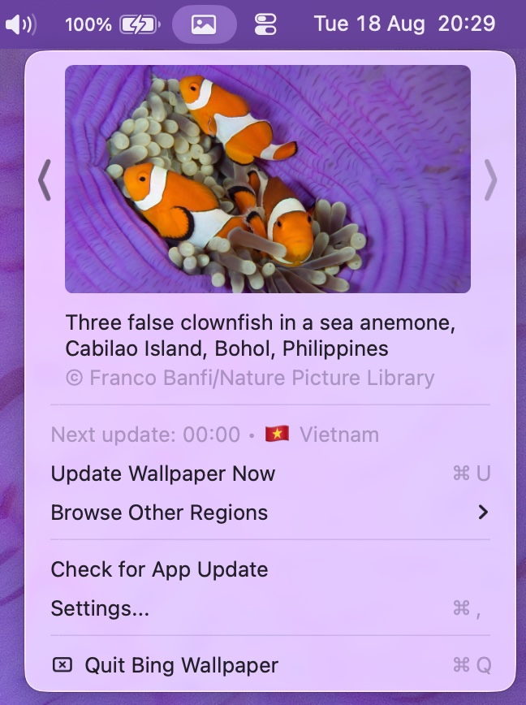

# Bing Wallpaper for Mac

**Bing Wallpaper for Mac is a free, open-source macOS menu bar app that automatically downloads the Bing image of the day and sets it as your desktop wallpaper — on every monitor and every Space.** It is the Mac equivalent of Microsoft's Bing Wallpaper desktop app, which Microsoft lists for Windows 10 and Windows 11 only ([system requirements](https://www.microsoft.com/en-us/download/details.aspx?id=101202)). If you searched for *bing wallpaper mac*, *bing daily wallpaper macOS*, *auto change wallpaper Mac*, *daily wallpaper changer for Mac*, or *download Bing picture of the day on Mac* — this is that app. It runs in the menu bar with no Dock icon, downloads at 4K (3840×2160), and covers 55 Bing country/market regions.


<p align="center">
  
  &nbsp;&nbsp;
  
</p>

## What it does, in numbers

| | |
|---|---|
| Bing market regions | **55** (8 pinned as popular, rest under *All Regions…*) |
| Wallpaper resolution downloaded | **3840×2160** — the app rewrites Bing's `1920x1080` URL to `UHD` |
| Network traffic per check | **1** HTTPS GET to `bing.com/HPImageArchive.aspx` (metadata for 8 days), plus the image itself only when it is new |
| Installed app bundle | **2.5 MB** (universal binary: 1.02 MB, `x86_64` + `arm64`) |
| Installer download | **1.5 MB** `.pkg` |
| Minimum macOS | **11.0** (`minos 11.0` in the shipped Mach-O) |
| Dock icon | none — `LSUIElement` is `true` |
| Retention options | 1 / 2 / 5 / 10 days, or keep forever |

## Features

**Automatic updates.** The app downloads the daily Bing image and applies it to all monitors and all Spaces (it uses AppleScript, which is the only reliable way to cover every Space). It lives in the menu bar, with no Dock icon.

**55 market regions.** Bing publishes a different image of the day per country. Pick yours in Settings: US, UK, Germany, France, Japan, China, Vietnam and about fifty more.

**Browse other regions.** From the menu you can pull today's image from any other region without touching your configured Market Region. The image you pick is downloaded and applied right away; "Back to My Region" returns you to your own region.

**Two scheduling modes.** Either check every N hours (default: 3), or update once a day at a fixed time. Setting `00:00` matches the moment Bing publishes new images. If the Mac is asleep or off at that time, the update runs when it wakes up.

**Image management.** Choose the download folder (default `~/Pictures/bing-wallpapers`) and how long to keep images: 1, 2, 5, 10 days, or forever. Older files are deleted automatically.

**System integration.** Launch at login, optional menu bar icon, optional notification when the wallpaper changes, an update check against GitHub Releases, and a Reset Database button to start over.

## Installation

The app is **not signed with an Apple Developer ID** and is not notarized, so macOS quarantines it after download. Clearing that quarantine flag with `xattr -cr` is a required, one-time step.

### 1. Download

Get `BingWallpaper.pkg` from the [Releases page](https://github.com/TuanBT/BingWallpaper-for-Mac/releases/latest).

### 2. Run the installer

Double-click the `.pkg`. It installs to `/Applications/BingWallpaper.app`.

If macOS blocks the installer ("cannot be opened because it is from an unidentified developer"), use any of these:

- Right-click the `.pkg`, choose **Open**, then **Open** again in the dialog
- Go to **System Settings → Privacy & Security**, scroll down, click **Open Anyway**
- Or clear the flag from Terminal first:
  ```bash
  xattr -cr ~/Downloads/BingWallpaper.pkg
  ```

### 3. Clear the quarantine flag

After the installer finishes, run this in Terminal:

```bash
sudo xattr -cr /Applications/BingWallpaper.app
```

Type your Mac password when asked (the characters stay invisible, that is normal) and press Return.

Skip this and macOS will likely show one of these:

- "BingWallpaper" is damaged and can't be opened. You should move it to the Trash.
- "BingWallpaper" can't be opened because Apple cannot check it for malicious software.
- "BingWallpaper" cannot be opened because the developer cannot be verified.

`xattr -cr` only removes the `com.apple.quarantine` extended attribute that macOS attaches to downloaded files. It does not change the app itself.

### 4. Launch

```bash
open /Applications/BingWallpaper.app
```

Launchpad or Finder works too. The icon shows up in the menu bar and the current Bing wallpaper is applied immediately.

### 5. Allow System Events

The first time the app sets a wallpaper, macOS asks for permission to control System Events. Click OK. If you denied it by mistake, re-enable it in **System Settings → Privacy & Security → Automation → BingWallpaper → System Events**.

<details>
<summary>Installing from the .zip instead</summary>

```bash
unzip ~/Downloads/BingWallpaper.zip -d ~/Downloads
mv ~/Downloads/BingWallpaper.app /Applications/
sudo xattr -cr /Applications/BingWallpaper.app
open /Applications/BingWallpaper.app
```
</details>

<details>
<summary>Uninstalling</summary>

```bash
# Quit the app first, then:
rm -rf /Applications/BingWallpaper.app
defaults delete com.tuan.BingWallpaper
rm -rf ~/Pictures/bing-wallpapers   # optional: downloaded images
```
</details>

## Usage

Click the menu bar icon to open the menu.

| Action | Shortcut |
|--------|----------|
| Update Wallpaper Now | <kbd>⌘</kbd><kbd>U</kbd> |
| Settings… | <kbd>⌘</kbd><kbd>,</kbd> |
| Quit Bing Wallpaper | <kbd>⌘</kbd><kbd>Q</kbd> |

The arrows on either side of the preview step through recently downloaded wallpapers, and the one you land on is applied straight away.

**Browse wallpapers from other countries**

1. Click the menu bar icon
2. Hover over **Browse Other Regions**
3. Pick a region (popular ones first, the rest under **All Regions…**)
4. That region's image of the day is downloaded and set as your wallpaper
5. Use **Back to My Region** when you are done

**Update at midnight every day**

1. Open Settings (<kbd>⌘</kbd><kbd>,</kbd>)
2. Tick **Update at specific time**
3. Set hour `0` and minute `0`

**Change region permanently**

1. Open Settings
2. Pick a region in the **Market Region** dropdown (for example Vietnam, which is `vi-VN`)
3. All later wallpapers come from that region

## Settings reference

| Setting | Description |
|---------|-------------|
| Launch at login | Start BingWallpaper after you log in |
| Hide icon at menubar | Run without a menu bar icon |
| Show update notification | Post a notification when the wallpaper changes |
| Auto-set newest wallpaper | Apply the newest image automatically after each check |
| Market Region | Country/region used for the daily Bing image |
| Update interval (hours) | How often to check for a new wallpaper |
| Update at specific time | Use a fixed daily update time instead of an interval |
| Image location | Folder where wallpapers are downloaded |
| Keep images from last N days | Retention for downloaded images (1 / 2 / 5 / 10 / infinite) |
| Reset Database | Clear the local image database and re-download |

## Requirements

- macOS 11.0 (Big Sur) or later
- An internet connection
- System Events automation permission, used to set the wallpaper across all Spaces

## Building from source

```bash
git clone https://github.com/TuanBT/BingWallpaper-for-Mac.git
cd BingWallpaper-for-Mac
open BingWallpaper.xcodeproj
```

Select the BingWallpaper scheme and press <kbd>⌘</kbd><kbd>R</kbd>. Full Xcode is required; Command Line Tools alone will not build it.

To produce `BingWallpaper.pkg` and `BingWallpaper.zip` for distribution:

```bash
chmod +x ReleaseUtils/build_release.sh
./ReleaseUtils/build_release.sh
```

[ReleaseUtils/RELEASE_GUIDE.md](ReleaseUtils/RELEASE_GUIDE.md) covers the rest of the release workflow.

## Troubleshooting

| Problem | Fix |
|---------|-----|
| "BingWallpaper is damaged and can't be opened" | `sudo xattr -cr /Applications/BingWallpaper.app` |
| App runs but the wallpaper never changes | Allow BingWallpaper to control System Events in Privacy & Security → Automation |
| Menu bar icon disappeared | It is probably hidden: run `defaults write com.tuan.BingWallpaper HIDE_MENU_BAR_ICON -bool false` and relaunch |
| Wrong or stale images | Settings → Reset Database, then Update Wallpaper Now |
| Nothing gets downloaded | Check that the folder in Image location exists and is writable |

## FAQ

### How do I automatically set the Bing image of the day as my wallpaper on macOS?

Install this app, launch it, and that is the whole setup. It fetches Bing's picture of the day and applies it to every monitor and every Space. macOS has no built-in way to do this — the Wallpaper pane in System Settings can rotate a local folder, but it cannot pull Bing's daily image. By default the app re-checks every 3 hours; you can switch to a fixed daily time instead (Settings → *Update at specific time*), and `00:00` lines up with when Bing publishes.

### Is Bing Wallpaper for Mac free? Is there a paid tier or a subscription?

Free, with no paid tier, no subscription, no account, and no in-app purchase. The source is in this repository and you can build it yourself with Xcode.

### What permissions does it need?

One: **Automation → System Events**. macOS asks the first time the app sets a wallpaper. The app uses AppleScript (`tell application "System Events" … tell every desktop`) because that is the way to cover every Space, not just the one you are looking at. If you denied it by accident, re-enable it under **System Settings → Privacy & Security → Automation → BingWallpaper → System Events**.

It does not ask for Full Disk Access, Screen Recording, Accessibility, or Contacts. It writes only to the download folder you choose (default `~/Pictures/bing-wallpapers`) and its own preferences.

### Does it send my data anywhere?

There are exactly two hostnames in the entire Swift source: `www.bing.com` (the image feed) and `github.com` (the "Check for App Update" button). No analytics SDK, no telemetry, no crash reporter, no account. You can verify this yourself:

```bash
grep -rho 'https://[^"]*' BingWallpaper --include='*.swift' | cut -d/ -f3 | sort -u
```

### Does it work with multiple monitors, multiple Spaces, and Stage Manager?

Multiple monitors and multiple Spaces: yes — that is what the AppleScript path is for; every desktop on every screen gets the same image. Stage Manager changes how windows are grouped, not what the desktop picture is, so the wallpaper the app sets is the one Stage Manager shows.

### Does it work on Apple Silicon? On Intel? On which macOS versions?

The shipped binary is universal — `lipo -archs` on it reports `x86_64 arm64`, so it runs natively on both Apple Silicon and Intel Macs. The Mach-O declares `minos 11.0`, so macOS 11 Big Sur is the floor. It is built and used day to day on macOS 26.

### Will it fight with my menu bar manager (Bartender, Ice, Hidden Bar, …)?

The app creates a standard `NSStatusItem` ([MenuController.swift](BingWallpaper/Controller/MenuController.swift)), not a custom floating window, so anything that manages ordinary menu bar items treats it like any other icon. If you would rather have no icon at all, Settings → *Hide icon at menubar* removes it and the app keeps updating in the background.

### I already use Microsoft's Bing Wallpaper app — can I just use that on my Mac?

No. Microsoft's official Bing Wallpaper download page lists its supported operating systems as "Windows 10, Windows 11" — macOS is not among them ([Microsoft Download Center](https://www.microsoft.com/en-us/download/details.aspx?id=101202), checked August 2026). This project exists to fill that gap on macOS. Beyond simply running on a Mac, it adds a 55-region picker and per-region browsing, which are described below.

### How is this different from the original 2h4u/BingWallpaper-for-Mac?

This is a fork of [2h4u/BingWallpaper-for-Mac](https://github.com/2h4u/BingWallpaper-for-Mac) and credits it as such. That project's README describes the core behaviour — "automatically downloads the newest bing wallpaper of the day and sets it as wallpaper for all your monitors (and spaces!)" — and does not document region selection, scheduling modes, or retention settings. What this fork adds on top: a 55-region market picker, a **Browse Other Regions** submenu that pulls another country's image of the day without changing your configured region, a fixed-daily-time schedule as an alternative to the interval, retention (1 / 2 / 5 / 10 days or forever), an in-app update check, and a `.pkg` installer.

### Why does macOS say "BingWallpaper is damaged and can't be opened"?

This is the most common install problem, and the app is not damaged. It is not signed with an Apple Developer ID and not notarized, so macOS attaches a `com.apple.quarantine` attribute to the download and Gatekeeper refuses to launch it. Remove the attribute:

```bash
sudo xattr -cr /Applications/BingWallpaper.app
open /Applications/BingWallpaper.app
```

The same command fixes the sibling messages — "can't be opened because Apple cannot check it for malicious software" and "the developer cannot be verified". `xattr -cr` only clears that extended attribute; it does not modify the app.

### Where are the downloaded wallpapers stored, and do they pile up?

Default `~/Pictures/bing-wallpapers`, changeable in Settings. Files are named by date (`20260819.jpg`). At 3840×2160 a Bing JPEG runs roughly 3–4 MB, so "keep forever" costs about 1.1–1.5 GB a year; the retention setting (1 / 2 / 5 / 10 days) deletes older files automatically.

### Can I get a different country's wallpaper without changing my settings?

Yes — menu bar icon → **Browse Other Regions** → pick a country. That region's image of the day is downloaded and applied immediately, and **Back to My Region** returns you to your configured region. Eight regions are pinned for quick access (US, UK, Germany, France, Japan, China, Korea, Vietnam) with the other 47 under *All Regions…*.

### Does it need to be running for the wallpaper to change? What if my Mac was asleep?

Yes, it needs to be running — turn on *Launch at login* in Settings so it starts with your session. If the Mac was asleep or off at the scheduled moment, the update runs when it wakes up rather than being skipped.

## Credits

Based on [2h4u/BingWallpaper-for-Mac](https://github.com/2h4u/BingWallpaper-for-Mac). Wallpapers come from Microsoft Bing and belong to their respective photographers and copyright holders.

## License

This repository does not carry a license file yet, and neither does the upstream project — GitHub's license API reports no license for [2h4u/BingWallpaper-for-Mac](https://github.com/2h4u/BingWallpaper-for-Mac). The source is public to read and build, but without an explicit license the default copyright terms apply. If you want to redistribute or reuse the code, open an issue and ask.
