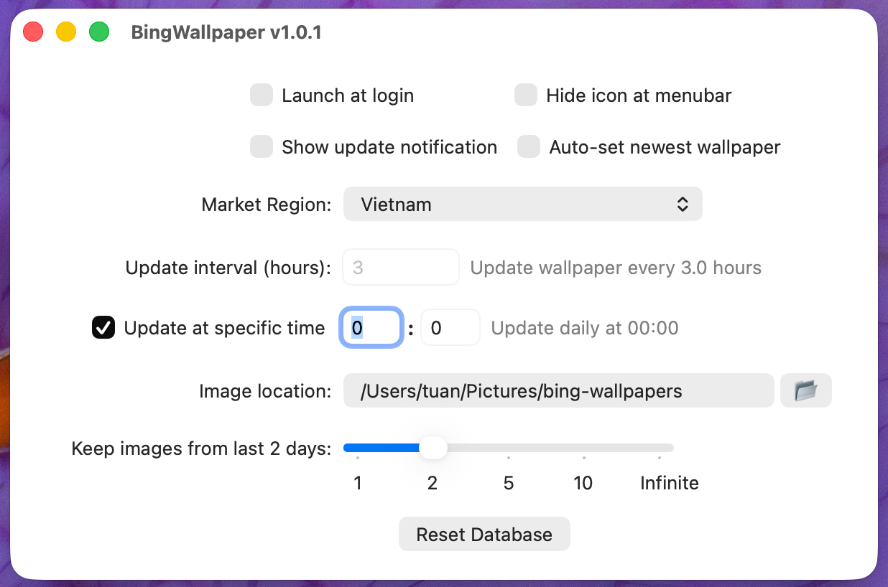

# Bing Wallpaper for Mac

A small macOS menu bar app that downloads the [Bing wallpaper of the day](https://www.microsoft.com/bing/bing-wallpaper) and sets it on every monitor and every Space.


<p align="center">
  
  &nbsp;&nbsp;
  
</p>

## Features

**Automatic updates.** The app downloads the daily Bing image and applies it to all monitors and all Spaces (it uses AppleScript, which is the only reliable way to cover every Space). It lives in the menu bar, with no Dock icon.

**55 market regions.** Bing publishes a different image of the day per country. Pick yours in Settings: US, UK, Germany, France, Japan, China, Vietnam and about fifty more.

**Browse other regions.** From the menu you can pull today's image from any other region without touching your configured Market Region. The image you pick is downloaded and applied right away; "Back to My Region" returns you to your own region.

**Two scheduling modes.** Either check every N hours (default: 3), or update once a day at a fixed time. Setting `00:00` matches the moment Bing publishes new images. If the Mac is asleep or off at that time, the update runs when it wakes up.

**Image management.** Choose the download folder (default `~/Pictures/bing-wallpapers`) and how long to keep images: 1, 2, 5, 10 days, or forever. Older files are deleted automatically.

**System integration.** Launch at login, optional menu bar icon, optional notification when the wallpaper changes, an update check against GitHub Releases, and a Reset Database button to start over.

## Installation

The app is **not signed with an Apple Developer ID** and is not notarized, so macOS quarantines it after download. Clearing that quarantine flag with `xattr -cr` is a required, one-time step.

### 1. Download

Get `BingWallpaper.pkg` from the [Releases page](https://github.com/TuanBT/BingWallpaper-for-Mac/releases/latest).

### 2. Run the installer

Double-click the `.pkg`. It installs to `/Applications/BingWallpaper.app`.

If macOS blocks the installer ("cannot be opened because it is from an unidentified developer"), use any of these:

- Right-click the `.pkg`, choose **Open**, then **Open** again in the dialog
- Go to **System Settings → Privacy & Security**, scroll down, click **Open Anyway**
- Or clear the flag from Terminal first:
  ```bash
  xattr -cr ~/Downloads/BingWallpaper.pkg
  ```

### 3. Clear the quarantine flag

After the installer finishes, run this in Terminal:

```bash
sudo xattr -cr /Applications/BingWallpaper.app
```

Type your Mac password when asked (the characters stay invisible, that is normal) and press Return.

Skip this and macOS will likely show one of these:

- "BingWallpaper" is damaged and can't be opened. You should move it to the Trash.
- "BingWallpaper" can't be opened because Apple cannot check it for malicious software.
- "BingWallpaper" cannot be opened because the developer cannot be verified.

`xattr -cr` only removes the `com.apple.quarantine` extended attribute that macOS attaches to downloaded files. It does not change the app itself.

### 4. Launch

```bash
open /Applications/BingWallpaper.app
```

Launchpad or Finder works too. The icon shows up in the menu bar and the current Bing wallpaper is applied immediately.

### 5. Allow System Events

The first time the app sets a wallpaper, macOS asks for permission to control System Events. Click OK. If you denied it by mistake, re-enable it in **System Settings → Privacy & Security → Automation → BingWallpaper → System Events**.

<details>
<summary>Installing from the .zip instead</summary>

```bash
unzip ~/Downloads/BingWallpaper.zip -d ~/Downloads
mv ~/Downloads/BingWallpaper.app /Applications/
sudo xattr -cr /Applications/BingWallpaper.app
open /Applications/BingWallpaper.app
```
</details>

<details>
<summary>Uninstalling</summary>

```bash
# Quit the app first, then:
rm -rf /Applications/BingWallpaper.app
defaults delete com.tuan.BingWallpaper
rm -rf ~/Pictures/bing-wallpapers   # optional: downloaded images
```
</details>

## Usage

Click the menu bar icon to open the menu.

| Action | Shortcut |
|--------|----------|
| Update Wallpaper Now | <kbd>⌘</kbd><kbd>U</kbd> |
| Settings… | <kbd>⌘</kbd><kbd>,</kbd> |
| Quit Bing Wallpaper | <kbd>⌘</kbd><kbd>Q</kbd> |

The arrows on either side of the preview step through recently downloaded wallpapers, and the one you land on is applied straight away.

**Browse wallpapers from other countries**

1. Click the menu bar icon
2. Hover over **Browse Other Regions**
3. Pick a region (popular ones first, the rest under **All Regions…**)
4. That region's image of the day is downloaded and set as your wallpaper
5. Use **Back to My Region** when you are done

**Update at midnight every day**

1. Open Settings (<kbd>⌘</kbd><kbd>,</kbd>)
2. Tick **Update at specific time**
3. Set hour `0` and minute `0`

**Change region permanently**

1. Open Settings
2. Pick a region in the **Market Region** dropdown (for example Vietnam, which is `vi-VN`)
3. All later wallpapers come from that region

## Settings reference

| Setting | Description |
|---------|-------------|
| Launch at login | Start BingWallpaper after you log in |
| Hide icon at menubar | Run without a menu bar icon |
| Show update notification | Post a notification when the wallpaper changes |
| Auto-set newest wallpaper | Apply the newest image automatically after each check |
| Market Region | Country/region used for the daily Bing image |
| Update interval (hours) | How often to check for a new wallpaper |
| Update at specific time | Use a fixed daily update time instead of an interval |
| Image location | Folder where wallpapers are downloaded |
| Keep images from last N days | Retention for downloaded images (1 / 2 / 5 / 10 / infinite) |
| Reset Database | Clear the local image database and re-download |

## Requirements

- macOS 11.0 (Big Sur) or later
- An internet connection
- System Events automation permission, used to set the wallpaper across all Spaces

## Building from source

```bash
git clone https://github.com/TuanBT/BingWallpaper-for-Mac.git
cd BingWallpaper-for-Mac
open BingWallpaper.xcodeproj
```

Select the BingWallpaper scheme and press <kbd>⌘</kbd><kbd>R</kbd>. Full Xcode is required; Command Line Tools alone will not build it.

To produce `BingWallpaper.pkg` and `BingWallpaper.zip` for distribution:

```bash
chmod +x ReleaseUtils/build_release.sh
./ReleaseUtils/build_release.sh
```

[ReleaseUtils/RELEASE_GUIDE.md](ReleaseUtils/RELEASE_GUIDE.md) covers the rest of the release workflow.

## Troubleshooting

| Problem | Fix |
|---------|-----|
| "BingWallpaper is damaged and can't be opened" | `sudo xattr -cr /Applications/BingWallpaper.app` |
| App runs but the wallpaper never changes | Allow BingWallpaper to control System Events in Privacy & Security → Automation |
| Menu bar icon disappeared | It is probably hidden: run `defaults write com.tuan.BingWallpaper HIDE_MENU_BAR_ICON -bool false` and relaunch |
| Wrong or stale images | Settings → Reset Database, then Update Wallpaper Now |
| Nothing gets downloaded | Check that the folder in Image location exists and is writable |

## Credits

Based on [2h4u/BingWallpaper-for-Mac](https://github.com/2h4u/BingWallpaper-for-Mac). Wallpapers come from Microsoft Bing and belong to their respective photographers and copyright holders.

## License

Open source. See the upstream project for the original terms.
